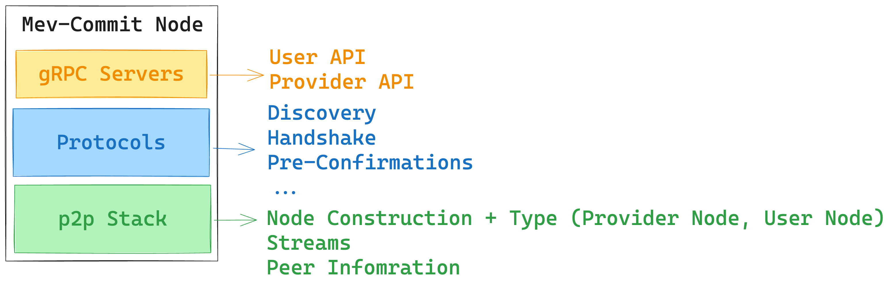

# mev-commit
mev-commit is a P2P software that creates a network of builders and searchers. Searchers can use it to broadcast bids to multiple builders and get pre-confirmations from them.



## Quickstart
- The software needs an ECDSA private key. This key creates the ethereum address for the node as well as used for the P2P network. Users can use an existing key or create a new key using the `create-key` command.
```
NAME:
   mev-commit create-key - Create a new ECDSA private key and save it to a file

USAGE:
   mev-commit create-key [command options] <output_file>

OPTIONS:
   --help, -h  show help
```

- Once the key is available the users need to create a yaml config file. Example config files are available in the [config](https://github.com/primevprotocol/mev-commit/tree/main/config) folder. The important options are defined below:
```yaml
# Path to private key file.
priv_key_file: ~/.mev-commit/keys/nodekey

# Type of peer. Options are builder and searcher.
peer_type: builder

# Port used for P2P traffic. If not configured, 13522 is the default.
p2p_port: 13522

# Port used for HTTP traffic. If not configured, 13523 is the default.
http_port: 13523

# Secret for the node. This is used to authorize the nodes. The value doesnt matter as long as it is sufficiently unique. It is signed using the private key.
secret: hello

# Format used for the logs. Options are "text" or "json".
log_fmt: text

# Log level. Options are "debug", "info", "warn" or "error".
log_level: debug

# Bootnodes used for bootstrapping the network.
bootnodes:
  - /ip4/35.91.118.20/tcp/13522/p2p/16Uiu2HAmAG5z3E8p7o19tEcLdGvYrJYdD1NabRDc6jmizDva5BL3

# The default is set to false for development reasons. Change it to true if you wish to accept bids on your builder instance
expose_builder_api: false
```

- After the config file is ready, run `mev-commit start` with the config option.
```
NAME:
   mev-commit start - Start the mev-commit node

USAGE:
   mev-commit start [command options] [arguments...]

OPTIONS:
   --config value  path to config file [$MEV_COMMIT_CONFIG]
   --help, -h      show help
```

- After the node is started, users can check the status of the peers connected to the node using the `/topology` endpoint on the HTTP port.
```json
{
   "self": {
      "Addresses": [
         "/ip4/127.0.0.1/tcp/13526",
         "/ip4/192.168.1.103/tcp/13526",
         "/ip4/192.168.100.5/tcp/18625"
      ],
      "Ethereum Address": "0x55B3B672DEB14178615F648911e76b7FE1B23e5D",
      "Peer Type": "builder",
      "Underlay": "16Uiu2HAmBykfyf9A5DnRguHNS1mvSaprzYEkjRf6uafLU4javG4L"
   },
   "connected_peers": {
      "builders": [
         "0xca61596ccef983eb7cae42340ec553dd89881403"
      ]
   }
}
```

## Building Docker Image

To simplify the deployment process, you may utilize Docker to create an isolated environment to run mev-commit.

- Build the Docker Image:
  Navigate to the project root directory (where your Dockerfile is located) and run:
  
  ```
  docker build -t mev-commit:latest .
  ```
- Running with Docker Compose:
 
  ```
  docker-compose up --build
  ```

- Stopping the Service:

  ```
  docker-compose down
  ```

## APIs for Searcher & Builder
[Link to Documentation on Searcher and Builder API](./pkg/rpc/README.md)
- This includes: 
   - the payload for the searcher API
   - The required setup for builders to process bids into commitments in their personal infra.
