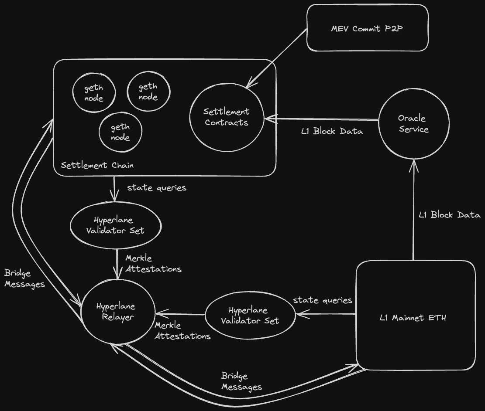

# Settlement Details

## Overview

Primev will maintain a settlement layer testnet consisting of a sidechain, oracle service, and bridge to Sepolia. 



## Connection details

### Bootnode Endpoint

[http://34.215.163.180:8545](http://34.215.163.180:8545)

### Frontend

[http://34.215.163.180](http://34.215.163.180)

### Block explorer

[http://34.209.10.199/blocks](http://34.209.10.199/blocks)

### Contract Addresses

TBD, depends on stable deployment.

### Joining the testnet

To join the testnet with your own full-node, use primev's [geth fork](https://github.com/primevprotocol/go-ethereum). We've modified geth to achieve shorter block periods than mainnet Ethereum, and to enable seamless native token bridging capabilities. Geth configuration will vary based on environment, but an example is provided below:

```bash
exec geth \
    --verbosity="$VERBOSITY" \
    --datadir="$GETH_DATA_DIR" \
    --port 30311 \
    --syncmode=full \
    --gcmode=full \
    --http \
    --http.corsdomain="*" \
    --http.vhosts="*" \
    --http.addr=0.0.0.0 \
    --http.port="$RPC_PORT" \
    --http.api=web3,debug,eth,txpool,net,engine \
    --bootnodes enode://34a2a388ad31ca37f127bb9ffe93758ee711c5c2277dff6aff2e359bcf2c9509ea55034196788dbd59ed70861f523c1c03d54f1eabb2b4a5c1c129d966fe1e65@172.13.0.100:30301 \
    --networkid=$CHAIN_ID \
    --unlock=$BLOCK_SIGNER_ADDRESS \
    --password="$GETH_DATA_DIR"/password \
    --mine \
    --miner.etherbase=$BLOCK_SIGNER_ADDRESS \
    --allow-insecure-unlock \
    --nousb \
    --netrestrict 172.13.0.0/24 \
    --metrics \
    --metrics.addr=0.0.0.0 \
    --metrics.port=6060 \
    --ws \
    --ws.addr=0.0.0.0 \
    --ws.port="$WS_PORT" \
    --ws.origins="*" \
    --ws.api=debug,eth,txpool,net,engine \
    --rpc.allow-unprotected-txs \
    --authrpc.addr="0.0.0.0" \
    --authrpc.port="8551" \
    --authrpc.vhosts="*" \
    --nat extip:$NODE_IP
```

Note this configuration will be productionized further in the coming weeks.

## Protocol

Our settlement layer is built out as an ethereum sidechain ran with [go-ethereum’s Clique proof-of-authoriy consensus mechanism](https://geth.ethereum.org/docs/tools/clef/clique-signing). 

### POA Geth Nodes

Primev currently maintains one bootnode who doesn’t participate in consensus, and two fullnode POA signers. The two signers swap back and forth between proposing the next block via a waiting period. Although our current network consists of three peers on a single EC2 instance, we plan to scale this to 10-20 peers on distinct EC2 instances. 

In order for mev-commit’s reward mechanism to be granular enough, the settlement layer must be able to commit blocks at a much faster rate than L1 ethereum. We’ve chosen a target block period of 200ms. Thus on average 72 blocks will be committed on our sidechain for every ethereum mainnet block. 

Future experimentation will help identify the maximize the number of signers that can feasibly achieve our 200ms block period constraint. Additionally, we'll be investigating the impact of geographical distance between signers on network latency.

### Contracts

Settlement contracts are deployed on the settlement chain to follow the state of bids and commitments, and invoke rewards or slashing as needed. Contracts are designed as follows:

* A pre-confirmation contract allows pre-confirmation commitments and bids from the p2p network to be tracked/updated on-chain.
* Two separate registry contracts exist to manage users and providers, where both parties must stake ETH to participate. Rewards and/or slashing are managed by these contracts. 
* An oracle contract emits events requesting the oracle service to retrieve block data from mainnet ethereum, and exposes an interface for the oracle service to submit said data.

### Oracle Service

The oracle service is an off-chain process which interacts with the oracle contract as needed. This service monitors and extracts the winning builder and corresponding transaction hash list from each mainnet block, and submits this data to the oracle contract residing on the settlement chain.

Although this oracle is currently centralized and operated by Primev, it can eventually be integrated into the settlement chain validation protocol, and secured by the same federated actors that operate the settlement chain.

### Bridge Settlement ↔ SepoliaETH

The settlement chain is bridged to Sepolia via a [hyperlane warp route](https://docs.hyperlane.xyz/docs/protocol/warp-routes), involving multiple agents delivering or validating cross chain messages.

Users initiate a bridge transaction on the origin chain by locking native ether in the bridge contract. A permissioned validator set monitors for these transactions and attests to their merkle inclusion on the origin chain. A permissionless relayer agent then delivers the message to the destination chain’s `Interchain Security Module` (ISM), which verifies validator signatures and mints native tokens as needed. 

Hyperlane exposes a contract interface which allows bridge users to pay relayers native tokens on the origin chain to cover the costs of delivering a message on the destination chain. See [Interchain Gas Payment](https://docs.hyperlane.xyz/docs/protocol/interchain-gas-payment) for more details.

Running a hyperlane relayer is permissionless, and we encourage anyone to run their own relayer relevant to the settlement bridge. See [Running Relayers](https://docs.hyperlane.xyz/docs/operate/relayer/run-relayer) for more details. In the future we will add entities to the validator set that signs off on bridge transaction merkle inclusion, and instructions for running validators will follow [Running Validators](https://docs.hyperlane.xyz/docs/operate/validators/run-validators).
